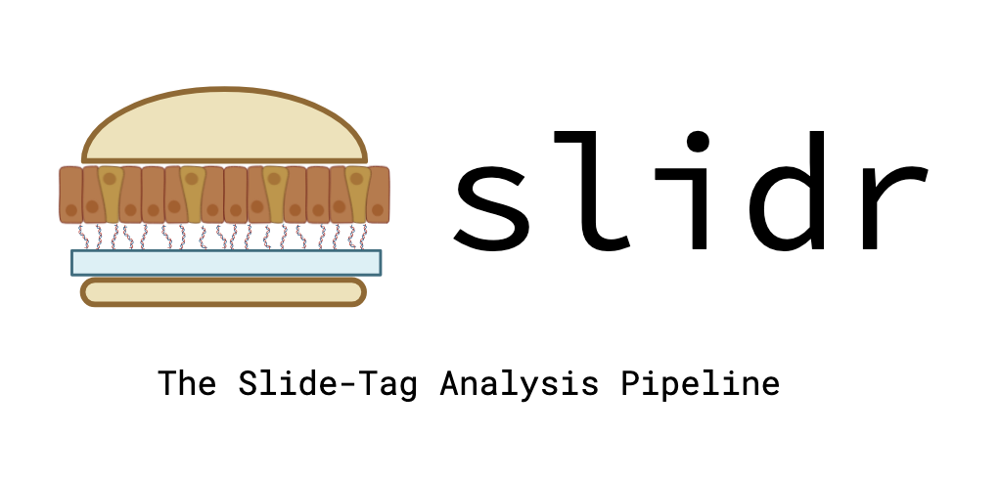

<p align="center">
  
</p>

# `slidr` — The Slide-Tag Analysis Pipeline

A pipeline for processing Slide-Tag spatial transcriptomics data. Starting from BCL files or pre-demultiplexed FASTQs, `slidr` runs demultiplexing, gene expression quantification, ambient RNA removal, and spatial barcode assignment to produce analysis-ready outputs.


## Pipeline stages

| Stage | Tool | Flag |
|---|---|---|
| BCL → FASTQ demultiplexing | Cellranger mkfastq | `--mkfastq` |
| Gene expression quantification | Cellranger count | `--count` |
| Ambient RNA removal | CellBender | `--cellbender` |
| Spatial barcode counting | Julia (spatial_count.jl) | `--spatial-count` |
| Spatial analysis | R / Seurat | `--spatial-analysis` |


## Requirements

**Must be installed manually** (proprietary licences):
- [Cellranger](https://www.10xgenomics.com/support/software/cell-ranger/downloads) — 8.0.1 by default;
  a per-sample `Cellranger` metadata column can select another installed release, and Flex chemistry
  needs 9.x for `cellranger multi`
- [bcl2fastq](https://support.illumina.com/sequencing/sequencing_software/bcl2fastq-conversion-software.html) ≥ 2.20

**Installed automatically by `./slidr`:**
- [uv](https://docs.astral.sh/uv/) — Python package management
- [Miniforge / conda](https://github.com/conda-forge/miniforge) — R environment management
- [Julia](https://julialang.org/) — spatial barcode processing

**Python dependencies** are managed by `uv` via `pyproject.toml`.  
**R dependencies** are managed by `conda` via `envs/conda.yml`. The environment is created on first
use, non-interactively — mamba 2.x otherwise stops to ask for confirmation, which nothing can answer
in a `--gcp` VM or a Slurm job.

---

## Installation

```bash
git clone https://github.com/kabanovskyd/slidr
cd slidr
```

No further setup is required — `./slidr` installs missing dependencies on first run.

### Staying up to date

`./slidr --update` fast-forwards this checkout to the newest slidr on GitHub:

```bash
./slidr --update
```

A run also checks once a day, and says so when the checkout is behind — the notice names the commits
and the version change, if the version moved:

```
──────────────────────────────────────────────────────────────────────
A newer slidr is available: 1.4.0-beta → 1.5.0 (5 commit(s) behind origin/main)
  cca132f Bump to 1.5.0
  eb128b0 Restrict cellranger count to the lanes the metadata declares
  ...
Update with: ./slidr --update
──────────────────────────────────────────────────────────────────────
```

It is a notice, never a question. `./slidr` submits Slurm jobs and creates VMs from scripts and cron
entries where nothing is watching stdin, so a launcher that blocked on a `y/n` would hang them. The
check is best-effort throughout: a login node with no route to github.com, an expired credential or a
missing remote costs nothing and never fails a run, and the network call is capped at ten seconds.

**Your `config/config.yaml` is safe.** It is tracked in the repository and you have to edit it to run
anything, so the update keeps local changes to any file the update itself does not touch. When the
update *does* change the same file, it stops before overwriting and tells you what to do:

```bash
git stash && ./slidr --update && git stash pop   # then re-apply any new config fields by hand
```

Dependencies are not installed by `--update`. The next run syncs them, so `--update` needs nothing
beyond git — no working Python environment, no network access to PyPI.

| Variable | Effect |
|---|---|
| `SLIDR_NO_UPDATE_CHECK=1` | Skip the check entirely — for cron, CI, or an air-gapped cluster |
| `SLIDR_UPDATE_INTERVAL=<seconds>` | How long between checks (default `86400`, one day) |

The check is skipped automatically when it cannot mean anything: a directory that is not a git
checkout, or a branch with no upstream. If this checkout has local commits of your own, the notice
says `git pull --rebase` instead, since `--update` fast-forwards only and will not rewrite your work.

---

## Configuration

Edit `config/config.yaml` before running:

```yaml
paths:
  output_path: /data/slidetag           # where outputs are written
  input_path: /mnt/sequencer            # root directory containing BCL run folders. Under
                                        # written with a gs:// scheme this is instead the prefix they
                                        # are staged from
  software_path: /mnt/lab_software      # directory scanned for Cellranger / bcl2fastq.
                                        # May also be a gs:// prefix, which is then staged
  raw_barcodes_path: /mnt/barcodes      # raw puck barcode files (BeadBarcodes.txt / BeadLocations.txt)
  puck_path: /mnt/pucks                 # processed puck CSV files (generated if absent)
  reference_path: /mnt/reference        # directory containing reference genome subdirectories
  auth_key_path: /path/to/auth_key.json # Google service account key; only needed for Sheet metadata.
                                        # May also be a gs:// object, read with `gcloud storage cat`
                                        # and never written to disk. Required to be gs:// under --gcp

settings:
  memory: 50                            # GB allocated to Cellranger
  threads: 16                           # cores allocated to Cellranger and Julia
  metadata_source: https://docs.google.com/spreadsheets/d/...#gid=0   # Sheet URL, or a .tsv/.csv path
  gcs_download_dest:                    # local dir a staged run downloads into; defaults to
                                        # <output_path>/<BCL_ID>/data
  output_bucket:                        # GCS bucket outputs are uploaded to after a run, into
                                        # <output_bucket>/<BCL_ID>/ (or <BCL_ID>_2/ if that exists)
  reference_genome: refdata-gex-GRCm39-2024-A   # directory name under reference_path
  alerts: false                         # send Slack alerts on errors/completion
  slack_token:                          # file path, gs:// object, or literal token (if alerts: true)

workflow:
  generate_bam: false
  cellbender_total_droplets:            # null to auto-detect from the barcode-rank plot
  cellbender_estimated_cells:           # null to let CellBender estimate
  cellbender_epochs: 160
  cellbender_learn_rate: 0.5
  spatial_downsampling:                 # optional float; thins spatial reads before counting
  top_n_percent_umi_filter:             # optional float 0-100; bead UMI filtering percentile
  flex_emptydrops_minimum_umis: 100     # Flex chemistry only
  flex_probe_set:                       # Flex chemistry only
  flex_spatial_R1_path:                 # Flex chemistry only
  flex_spatial_R2_path:                 # Flex chemistry only
  flex_gex_fastqs:                      # Flex chemistry only; list of GEX FASTQ prefixes
```

Numeric fields must be given as plain numbers. Note that YAML reads the bare words `yes`/`no`/`on`/`off`
as booleans, so `threads: no` is rejected rather than silently treated as `0`.

To read inputs from Google Cloud Storage, point `input_path`,
`reference_path`, `puck_path` and `raw_barcodes_path` at `gs://` locations instead of local directories.
Staged data lands in `settings.gcs_download_dest`, or — left unset — under the run's own directory at
`<output_path>/<BCL_ID>/data`.

`software_path` may also name a `gs://` location, in which case the Cellranger/bcl2fastq tree is
downloaded to `output/software/` before it is scanned. Unlike the three above it is *not* required to
be a bucket on a staged run — a local directory stays valid, because the machine running the pipeline
usually has the software installed already (the `--gcp` VM image does). Two consequences of a staged
software tree worth knowing:

- Only a full `gs://…` URL triggers it. The bare `bucket/prefix` form the other paths accept is not
  honoured here, since it cannot be told apart from a relative local directory and guessing wrong means
  a multi-GB download instead of an error.
- **No flag is required.** A `gs://` URL is unambiguous, so it is acted on by itself; this field led the
  way on that rule and the other four now follow it. When the run stages nothing else, a `[NOTE]` on
  startup says the download is coming.
- The download happens once per run, lazily — a `software_cache.txt` that already pins the executables
  skips it entirely — and is reused by later runs sharing the output tree. Because GCS does not carry
  POSIX permissions, execute bits are restored on the staged copy afterwards.

### `paths.input_path`

Where the run reads its reads from. It is dual-purpose, exactly like `reference_path`, `puck_path` and
`raw_barcodes_path`: a local directory of run folders for a local run, and the GCS prefix those folders
are staged out of. Which one it is is read from the value itself: a `gs://` URI is staged, anything else
is a local directory. No flag is needed to use a bucket, and the four path fields may differ from one
another — bucket data with a local reference genome is an ordinary configuration. A bare
`bucket/prefix` is not accepted, being indistinguishable from a relative directory: write the scheme.
This is the only place the location is configured; there is no command-line equivalent.

```yaml
# local run
paths:
  input_path: /mnt/sequencer

# staged run -- the scheme is what makes it one
paths:
  input_path: gs://slidr_data/inputs
```

The prefix holds sequencing data and nothing else:

| Object | `--gcp` | `--slurm` (staged) |
|---|---|---|
| `<BCL_ID>/` run folder | required | required |
| further run folders named by `Merge RNA From BCL` / `Merge Spatial From BCL` | required for a split-BCL run | required for a split-BCL run |
| `config.yaml` | **not here** — `./slidr --gcp` uploads your local one to `<output_bucket>/<BCL_ID>/config.yaml` and the VM boots from that | **not used** — the job runs with `config/config.yaml` from the checkout it was submitted from |
| `auth_key.json` | **not here** — point `paths.auth_key_path` at a `gs://` object; it is read with `gcloud storage cat`, never downloaded | same |

Upload the run folders before launching — the pipeline never puts them there for you. `./slidr` reads
this field locally and hands the location to the VM or compute node, which then downloads what it needs.

A library sequenced across more than one run needs every one of those run folders under this same
prefix, each named exactly as the metadata spells it. The pipeline downloads them itself, once the
metadata has been read — just before demultiplexing, and only if demultiplexing actually runs. The
launcher scripts fetch no sequencing data at all: they know only the one BCL ID they were handed, and
which *other* run folders a split-BCL run needs is stated nowhere but the metadata. A run folder already
present on the compute node is left alone; set `RESTAGE=1` in the environment to re-download it.

A bare `--fastqs` on a staged run needs no path either: it resolves to the staged copy of
`<input_path>/<BCL_ID>`, so a bucket folder of already-demultiplexed FASTQs works the same way a BCL
folder does.

Neither mode needs a config in the bucket, for the same underlying reason: the config a run uses should
be the file you just edited, and a second copy kept somewhere by hand can only drift from it. A Slurm job
runs from a real checkout on a cluster you administer, so it reads `config/config.yaml` directly; a `--gcp`
run has no checkout, so `./slidr` uploads that same file at launch. In practice a config change takes
effect on your next launch with nothing to re-upload either way, and the CPU/memory `./slidr` requests
from Slurm are read from the same file the job itself will use. See
[`settings.output_bucket`](#settingsoutput_bucket) for where the `--gcp` copy lands.

`--gcp` always stages, since a fresh VM has nothing else to read. A `--slurm` run stages whatever its
config names with a `gs://` prefix; with a local `input_path` it reads everything off the cluster's own
filesystem instead. There is no flag either way — the value decides.

### `settings.gcs_download_dest`

The local directory a staged run downloads `input_path` into. Left unset it defaults to
`<output_path>/<BCL_ID>/data`, so a staged run writes nothing outside its own run directory and needs no
per-machine configuration — which is what a fresh VM or a cluster job can count on.

It sits beside `output/` rather than inside it on purpose: `settings.output_bucket` uploads `output/`
when a run succeeds, and this directory holds raw inputs that came *out* of a bucket. Staging them under
`output/` would send the entire sequencing run — hundreds of GB — straight back to GCS every time a run
finished. (The reference genome and a staged `software_path` land under `output/` and are excluded from
the upload individually for the same reason; the sequencing data is far too large to handle that way.)

Set it to move that data elsewhere, typically cluster scratch:

```yaml
settings:
  gcs_download_dest: /scratch/$USER/slidr-data
```

A per-host value can be exported as `SLIDR_GCS_DOWNLOAD_DEST` instead of edited into a shared config.
Local runs ignore the field entirely.

### `settings.output_bucket`

Where the run's `output/` tree is copied once it has succeeded — and, for a `--gcp` run, where its
config is uploaded at launch and where its logs are sent however the run ends. The results land in a
folder named for the run, and a folder that is already there is never written over:

```
gs://<output_bucket>/20240101_RUNID/      # first run of this BCL
├── config.yaml                           #   --gcp only: the config this run booted with
├── log/                                  #   --gcp only: runtime.log, the summary, per-stage tool logs
├── metadata/                             #   --gcp only: the rows and samplesheets this run used
├── mkfastq/
├── count/
└── ...
gs://<output_bucket>/20240101_RUNID_2/    # a later run of the same BCL
gs://<output_bucket>/20240101_RUNID_3/    # and the one after that
```

Two directories under `output/` are deliberately left out of the upload: `reference/` and `software/`,
which a staged run downloads its own *inputs* into. Sending them back would return the bytes to the
bucket they were read out of minutes earlier — on a mouse run, 14 GiB of reference genome and 2.5 GiB
of Cellranger against roughly 5 GiB of actual output. `pucks/` and `barcodes/` are kept, since a puck
CSV may have been generated during the run rather than downloaded.

`log/` and `metadata/` are uploaded by a separate step that runs however the process exits, including
every crash — which is when they matter most, since a `--gcp` VM deletes itself and takes its disk with
it. That step is a no-op for local and `--slurm` runs, whose logs are already on a filesystem that
outlives them. It cannot cover a hard kill (an OOM or a preempted VM runs no exit hook), and errors
raised while the config is still being loaded happen too early for it — those stay visible through
`watch_run.sh`, which reads Cloud Logging rather than the bucket.

**`--gcp` requires this field.** `./slidr --gcp` uploads your local `config/config.yaml` into the folder
above and hands the VM its URI, so the VM boots from the file you just edited rather than a copy kept in a
bucket by hand. It was already required in practice: the VM self-deletes, so a run without it discarded
everything it produced. A local or `--slurm` run may still leave it unset, in which case nothing is
uploaded and the outputs stay on the machine that ran the job.

Keeping the config in the results folder means each folder records the configuration that produced it. It
also means `./slidr` has to choose the folder *before* creating the VM, and passes that choice down so the
run uploads exactly there — which as a side effect claims the name, so two `--gcp` launches of one BCL
cannot both land on it.

The suffix is chosen by asking the bucket what is already there (`gcloud storage ls`), so it reflects
the folders that exist rather than a counter the pipeline keeps. Two points worth knowing:

- **Each folder holds only what that run produced.** Re-running a single stage uploads a new folder
  containing just that stage's outputs, not a copy of the complete set sitting next to it. The complete
  set is always the local run directory.
- **It is not a lock.** Two runs of the same BCL finishing at the same moment can pick the same free
  name; GCS offers no way to reserve a prefix in advance.

Numbering rather than overwriting is deliberate: the upload is the last thing a run does, hours of
compute after the point where a mistake could still be caught, and nothing distinguishes a deliberate
re-run from an accidental second launch. Deleting the folder you did not want is recoverable — and
`gcloud storage rm -r gs://<output_bucket>/<BCL_ID>` before a re-run is how you get the unsuffixed name
back.

This is the only copy of anything a `--gcp` VM leaves behind, since the VM deletes itself when it
finishes — results only if the run succeeded, logs either way.

### Google Sheets authentication

If you are reading input metadata from a Google Sheet, you will first need to download an authentication key that will allow your program to interface with it. You can do so by following the steps below:

1. Navigate to your project within Google Cloud Console (top dropdown)
2. Navigate to the left sidebar -> APIs & Services -> Enabled APIs & Services
3. Check that the list of enabled services includes `Google Sheets API` and `Google Drive API`; if not, add them with the "Enable APIs and Services" button
4. Navigate to the "Credentials" tab in the "APIs & Services" sidebar
5. Click on "Create credentials" button and follow the steps to create a service account
6. Under the "Service Accounts" section on the same page, click on the email of the account you just created, navigate to the "Keys" tab, and click on "Add keys" -> "Create new key" -> "JSON"
7. Connect your service account to the Google Sheet: navigate to the sheet URL, click the "Share" button, paste the service account email, and give it "Editor" permissions
8. Add the path to the downloaded JSON key to the `paths.auth_key_path` field in the configfile and **keep it secure** - __never share, commit, or otherwise expose your key to people outside your organization__.

   The field also accepts a `gs://` object, which is the recommended form and the only one that works
   with `--gcp`. Upload the key once and point the field at it:

   ```yaml
   paths:
     auth_key_path: gs://my-bucket/secrets/auth_key.json
   ```

   The pipeline reads it with `gcloud storage cat` and parses it in memory at the moment it opens the
   metadata sheet, so the key exists only for the life of the process and is never written to the disk of
   any machine that runs the pipeline. Nothing stages a key file — neither the `--gcp` VM nor a Slurm job
   downloads one — which is why a `gs://` value is required under `--gcp`: a freshly created VM has no
   local key to point at. `./slidr` catches that at launch rather than letting the VM boot and fail.

   Access is governed by the *active gcloud account* on the machine doing the reading (the VM's
   `slidr-runner` service account, or whatever `gcloud auth list` shows on a cluster), which needs read
   access to that object. The identity inside the key is a separate thing: it is what needs access to the
   Sheet itself.

   A run whose metadata is a local `.tsv`/`.csv` never reads the field at all.

### Software cache initialization

`Slidr` will automatically search for matching software executables in the provided software directory and populate a cache file (`software_cache.txt`) in the project root to save executable paths for future runs. However, this step make take a while - to skip this (or specify a specific executable version if you have several versions installed), create the software cache file and add absolute paths on individual lines:

```
/path/to/lab_software/cellranger-8.0.1/bin/cellranger
/path/to/lab_software/bcl2fastq2_v2.20.0/bin/bcl2fastq
/home/unix/your_username/.juliaup/bin/julia
...
```

### Metadata format

Sample metadata must be supplied as a Google Sheet or a `.tsv`/`.csv` file, and must contain all of the
following columns:

| Column | Description |
|---|---|
| `Run` | `YES` to include this sample, anything else to skip |
| `Email` | User email, used for Slack notifications |
| `Sample Name` | Unique sample identifier — two rows in one run may not share it unless they are identical (see below) |
| `BCL` | BCL run ID (matched to `--bcl`); the run folder is resolved as `input_path/<BCL>` |
| `Species` | `Human` or `Mouse` (selects the reference genome automatically) |
| `Chemistry` | Sequencing chemistry, e.g. `3Pv3`, `5P`, `Flex` |
| `RNA Index` | Cellranger index for the RNA library |
| `Lane` | Sequencing lane(s), comma-separated |
| `SB Index` | Cellranger index for the spatial barcode library |
| `SB Lane` | Lane(s) for the spatial barcode library, comma-separated |
| `Puck ID` | Identifier matching a puck CSV in `puck_path` |

Duplicate rows are handled for you. A shared sheet accumulates them easily — copy a row to start a
new sample, or paste a block twice — and two rows naming the same sample would have cellranger
demultiplex the same index twice into the same directory, with every later stage counting it twice.
What happens depends on whether the rows agree:

- **Identical rows** — the extras are dropped, named in the log, and the run continues.
- **Same `Sample Name`, something different** — the run stops, naming the columns that disagree and
  both lines of the sheet. Choosing one for you would be a guess, and the run would finish and produce
  plausible output from the wrong index, puck or chemistry.

Only the rows selected for this run are considered, so a sample that appears once per BCL is fine, as
is a duplicate left in the sheet with `Run: NO`. Trailing spaces and the difference between a blank
and an empty cell are ignored when comparing, so a sloppy copy is still recognised as a copy.

These columns are optional, and only read when non-empty:

| Column | Description |
|---|---|
| `Merge RNA From BCL` | Additional BCL to merge RNA FASTQs from. Its run folder is demultiplexed alongside the primary one, and staged from the `paths.input_path` prefix when that is a `gs://` location |
| `Merge Spatial From BCL` | Additional BCL to merge spatial FASTQs from, staged and demultiplexed the same way |
| `Add RNA Index` | Index for the merged-in RNA library |
| `Add SB Index` | Index for the merged-in spatial library |
| `Add Puck ID` | Puck override for a merged sample |
| `Cellranger` | Per-sample Cellranger version override, e.g. `V8` or `8.0.1` (default `8.0.1`; `9.0.1` for Flex) |
| `Flex Probe Barcode IDs` | Probe barcode IDs (required for `Flex` chemistry), separated by `,` or `\|` |

For a Google Sheet, the worksheet tab is taken from the `#gid=` fragment of the URL. Column names are
matched exactly, including case and spacing.

> A ready-to-edit `example_metadata.tsv` is included in the repository root, carrying every column
> above. Its rows show a two-sample 3' run, a skipped row (`Run: NO`), a cross-BCL RNA merge, a
> `Cellranger` override and a Flex pool. Optional columns you leave empty are ignored.

---

## Usage

`./slidr` is the single entry point for local, GCP and Slurm runs. It installs any missing
dependencies, then either runs the pipeline in your current shell or dispatches it to a VM or the
scheduler:

```bash
./slidr --bcl <BCL_ID> [options]
```

### Run the full pipeline

```bash
# locally
./slidr --bcl RUN_20240101 --run-all

# on a GCP VM (streams logs back; see paths.input_path above)
./slidr --bcl RUN_20240101 --gcp --project my-project --run-all

# as a Slurm job
./slidr --bcl RUN_20240101 --slurm --run-all
```

### Run individual stages

```bash
# Demultiplexing only
./slidr --bcl RUN_20240101 --mkfastq

# Gene expression quantification (supply FASTQs directly)
./slidr --bcl RUN_20240101 --count --fastqs /path/to/fastqs

# Ambient RNA removal
./slidr --bcl RUN_20240101 --cellbender

# Spatial barcode counting
./slidr --bcl RUN_20240101 --spatial-count

# Spatial analysis
./slidr --bcl RUN_20240101 --spatial-analysis

# Everything except ambient RNA removal, overwriting existing outputs
./slidr --bcl RUN_20240101 --run-all --no-cellbender --force
```

### All options

Run `./slidr --help` for the authoritative list.

**Stage selection and general options**

| Flag | Description |
|---|---|
| `--bcl BCL_ID` | BCL run ID (**required**, except with `--version`/`--help`) |
| `--run-all` | Run all pipeline stages end-to-end (the default if no stage flag is given) |
| `--mkfastq` | Run Cellranger mkfastq only |
| `--count` | Run Cellranger count only |
| `--cellbender` | Run Cellbender only |
| `--no-cellbender` | Skip Cellbender when running the full pipeline |
| `--spatial-count` | Run spatial barcode counting only |
| `--spatial-analysis` | Run spatial analysis only |
| `--fastqs [PATH]` | Run on already-demultiplexed FASTQs; skips mkfastq (mutually exclusive with `--mkfastq`). PATH is optional — with no value the FASTQs are read from `paths.input_path`. The `Lane` column is passed to cellranger as `--lanes`, so a shared delivery directory's other lanes are not read for this sample; blank or `*` reads every lane |
| `--force` | Overwrite existing outputs and re-run |
| `--version`, `-v` | Print the pipeline version and exit |
| `--update`, `-u` | Pull the newest slidr from GitHub and exit — see [Staying up to date](#staying-up-to-date) |
| `--help`, `-h` | Print usage and exit |

**Where the run executes**

| Flag | Description |
|---|---|
| `--gcp` | Run on a GCP VM, streaming logs back to your terminal |
| `--slurm` | Submit as a Slurm batch job |
| *(no flag)* | Where inputs are staged from is configuration, not a flag — set `paths.input_path` in `config/config.yaml` to the `gs://` prefix, and staging follows from the scheme. `--gcp` always stages, since a fresh VM has nothing else to read |

**GCP options** (only with `--gcp`)

| Flag | Default | Description |
|---|---|---|
| `--project PROJECT` | none — pass explicitly | GCP project ID |
| `--zone ZONE` | `us-central1-a` | Compute zone |
| `--machine TYPE` | `n1-standard-16` | Machine type |
| `--disk SIZE` | `200GB` | Boot disk size |
| `--gpu [TYPE]` | off; `nvidia-tesla-t4` when bare | Attach a GPU; TYPE is an optional GCE accelerator name (e.g. `nvidia-l4`). Also valid with `--slurm`, where it means something different — see below |

**Slurm options** (only with `--slurm`; CPUs and memory come from `settings.threads`/`settings.memory`)

| Flag | Default | Description |
|---|---|---|
| `--partition NAME` | cluster default | Partition to submit to |
| `--time LIMIT` | `24:00:00` | Job time limit |
| `--workdir PATH` | derived — see below | Where to stage inputs and write outputs |
| `--gpu [TYPE]` | off | Request a GPU: a bare `--gpu` submits with `--gres=gpu:1`, `--gpu TYPE` with `--gres=gpu:TYPE:1` |

`--gpu` is shared with `--gcp` but means a different thing on each. Under `--slurm`, TYPE is a **gres
type from your cluster's `gres.conf`** — `a100`, `v100`, `a100_80gb`; `sinfo -o '%G'` lists what the
partitions offer — not a GCE accelerator name. Underscores are ordinary in gres names and are accepted
here, where `--gcp` rejects them, and a value starting with `nvidia-` produces a warning, since it is
nearly always pasted from a `--gcp` command and no cluster will recognise it.

```bash
./slidr --bcl 20240101_RUNID --slurm --gpu                      # --gres=gpu:1
./slidr --bcl 20240101_RUNID --slurm --gpu a100 --partition gpu # --gres=gpu:a100:1
```

It always requests exactly one GPU. CellBender is the pipeline's only GPU consumer and trains on a
single device, so a second card would sit idle while making the job harder to schedule. Only the
CellBender stage uses it; everything else is CPU-bound, so on a cluster that bills GPU partitions by
the hour it is often cheaper to run `--cellbender` as its own GPU job.

For a staged run the workdir is normally derived, so you rarely pass `--workdir`. It resolves in order:

1. `--workdir`, if given
2. the parent of `paths.output_path` in the config the job will run with
3. `$SCRATCH/slidr`, if `$SCRATCH` is set
4. `<repo>/slidr-work/<BCL_ID>` — a last resort, and usually the wrong filesystem for hundreds of GB

Whichever applies is printed at submit time along with where it came from, so a large download never
lands somewhere unexpected.

Two things a staged run needs are set up outside slidr rather than through flags:

- **GCS credentials.** Run `gcloud auth login` once on the submit node; it persists to
  `~/.config/gcloud`, which compute nodes see on a shared home. On a headless cluster use
  `gcloud auth activate-service-account --key-file=/path/to/key.json` instead, which persists the same
  way. If your home is *not* shared with compute nodes, point `CLOUDSDK_CONFIG` at somewhere that is.
- **`software_path` for this cluster**, if you would rather not edit `config/config.yaml`. Export the
  override before submitting — `sbatch` passes the environment through:
  ```bash
  export SLIDR_SOFTWARE_PATH=/opt/cellranger
  ./slidr --bcl 20240101_RUNID --slurm      # input_path is a gs:// prefix
  ```
  The same works for `SLIDR_INPUT_PATH` and `SLIDR_OUTPUT_PATH`, though the staging script sets
  `SLIDR_OUTPUT_PATH` itself, and for `SLIDR_AUTH_KEY_PATH` — which nothing sets for you any more, since
  no key is staged.
  Alternatively, point `software_path` at a `gs://` location and let the job download the software.

`workflow/main.py` additionally accepts `--config PATH` to run against a config file outside `config/`,
and nothing else — staging follows from a path's `gs://` scheme. Neither
is exposed on `./slidr` itself.

---

## Output structure

```
<output_path>/                       # `paths.output_path` from the config file
└── <BCL_ID>/                        # one directory per run, named for --bcl
    ├── log/                         # a record of how the run went
    │   ├── runtime.log              # pipeline execution log
    │   ├── <timestamp>_summary.log  # short overview of execution settings / details
    │   ├── mkfastq.log              # console output from Cellranger mkfastq
    │   ├── count.log                # console output from Cellranger count (and multi, for Flex)
    │   ├── cellbender.log           # console output from CellBender
    │   ├── spatial_barcodes.log     # console output from spatial_count.jl / generate_puck_csv.jl
    │   ├── spatial_analysis.log     # console output from the R / Seurat analysis scripts
    │   └── takara_pipeline.log      # Flex only: Trekker demux / profiling / merge output
    ├── metadata/                    # the resolved inputs describing what this run processes
    │   ├── metadata_summary.csv     # the metadata rows selected for this run
    │   ├── samplesheet.csv          # Cellranger sample sheet generated from them
    │   └── multi_samplesheet.csv    # Flex only: sample sheet for `cellranger multi`
    ├── output/                      # pipeline outputs organized by the module that produced them
    │   ├── mkfastq/                 # demultiplexed FASTQs
    │   ├── count/                   # Cellranger count outputs per sample
    │   │   └── flex/                # Flex only: one folder per probe barcode, from `cellranger multi`
    │   ├── cellbender/              # CellBender filtered matrices per sample
    │   ├── spatial_barcodes/        # SBcounts.h5 per sample
    │   ├── spatial_analysis/        # Seurat objects, coordinates, summary PDFs
    │   ├── flex/                    # Flex only: Takara / Trekker spatial intermediates
    │   │   ├── demux/               # spatial reads split per probe barcode by Trekker
    │   │   ├── pucks/               # bead barcode files downloaded from Takara
    │   │   ├── samplesheets/        # generated Trekker demux / profiling / merge sheets
    │   │   └── trekker/             # per-partition nuclei positioning output
    │   ├── reference/               # staged only: local copy of the reference genome (not uploaded)
    │   ├── software/                # only when `software_path` is a gs:// prefix (not uploaded)
    │   ├── pucks/                   # staged only: puck coordinate CSVs, downloaded or generated
    │   └── barcodes/                # staged only: raw bead barcodes for puck generation
    ├── data/                        # staged only: run folders downloaded from `paths.input_path`,
    │                                #   one per BCL this run demultiplexes. A sibling of output/, not
    │                                #   inside it — see `settings.gcs_download_dest`
    └── tmp/                         # temporary Cellranger output directory
```

No single run contains every entry: the `flex/` tree, `multi_samplesheet.csv` and `takara_pipeline.log`
appear only for Flex chemistry, `reference/`/`pucks/`/`barcodes/`/`data/` only when staging from GCS,
and `software/` only when `paths.software_path` is a `gs://` prefix. Of these, `reference/`, `software/`
and `data/` hold inputs the run downloaded rather than results it produced, and none of the three is
uploaded to `settings.output_bucket`. The
run directory is `<output_path>/<BCL_ID>/`, unless `output_path` already ends in the BCL ID — in which
case it is taken as the run directory itself rather than nested again.

### Key output files per sample

| File | Stage | Description |
|---|---|---|
| `count/<sample>/outs/filtered_feature_bc_matrix.h5` | count | Cellranger filtered expression matrix |
| `cellbender/<sample>/cellbender_output_filtered.h5` | cellbender | Ambient-corrected expression matrix |
| `spatial_barcodes/<sample>/SBcounts.h5` | spatial-count | Cell barcode → spatial coordinate mapping |
| `spatial_analysis/<sample>/seurat.qs` | spatial-analysis | Seurat object with spatial embeddings |
| `spatial_analysis/<sample>/coords.csv` | spatial-analysis | Cell coordinates |
| `spatial_analysis/<sample>/summary.pdf` | spatial-analysis | QC summary plots |

---

## Troubleshooting / known issues
- **`bcl2fastq software not found on the system`**
  - Demultiplexing needs it, and it was in neither `software_cache.txt` nor the single directory `paths.software_path` names. Only that one tree is scanned, so if your Cellranger release and your bcl2fastq install live in different places, pin the missing one in `software_cache.txt` (one absolute path per line) instead of moving anything — the executable is `bcl2fastq`, inside e.g. `bcl2fastq2_v2.20.0/bin/`. If the reads are already demultiplexed, `--fastqs` skips the stage entirely.
- **`the Miniforge installer failed` / conda reinstalled on every run**
  - Fixed. `ensure_conda` used to decide by `command -v conda` alone, but the install only puts conda on `PATH` for that one script run — `conda init bash` writes `~/.bashrc`, which a later non-interactive `./slidr` never reads. Every run therefore tried to install again, and the Miniforge installer refuses a prefix that already exists. It now looks for an existing installation first (`$CONDA_ROOT`, `$MAMBA_ROOT_PREFIX`, `~/miniforge3`, `~/mambaforge`, `~/miniconda3`, `~/anaconda3`, `/opt/miniforge3`, `/opt/conda`) and puts it on `PATH`. If your conda lives somewhere else, export `CONDA_ROOT=/path/to/it` and it will be found. A prefix that exists but has no runnable `bin/conda` is a broken install and is now repaired in place (`-u`) rather than being a permanent block.
- **`the metadata declares the same sample more than once, with different values`**
  - Two rows selected for this run share a `Sample Name` but disagree somewhere; the error names the columns and both sheet lines. Keep the correct row and delete the other, rename one sample if they are genuinely different, or set `Run` to `NO` on the one you do not want. A library sequenced across two runs is not a second row — use `Merge RNA From BCL` / `Merge Spatial From BCL` instead. Rows that are *identical* are dropped automatically with a warning rather than stopping the run.
- **Cellranger refusing to run**
  - If you're attempting to re-run the mkfastq and count stages of the analysis, you need to **manually delete the output directories for those modules**, as cellranger will refuse to overwrite existing files and will crash.
- **`settings.output_bucket` is not set, so a --gcp run has nowhere to put its config or its results**
  - `--gcp` now uploads `config/config.yaml` there for the VM to boot from, so the field is required rather than optional. It always mattered: the VM self-deletes, so a run without it threw its results away. See [`settings.output_bucket`](#settingsoutput_bucket).
- **`auth_key_path` must be a gs:// object for a --gcp run reading its metadata from a Google Sheet**
  - The key is no longer copied onto the VM, so a local path names a file that does not exist there. Upload it once and point the field at the `gs://` object; see [Google Sheets authentication](#google-sheets-authentication). Raised at launch, before a VM is created.
- **`could not upload the config to ...`**
  - Raised by `./slidr` before the VM exists, so it costs nothing to retry. Usually no write access to `settings.output_bucket` — gcloud's own error is printed above the hints.
- **Results uploaded to `<BCL_ID>_2` rather than `<BCL_ID>`**
  - Working as intended: `<output_bucket>/<BCL_ID>` already existed, so the run was placed beside it instead of over it. Delete the old folder (`gcloud storage rm -r gs://<output_bucket>/<BCL_ID>`) before re-running to reclaim the plain name. See [`settings.output_bucket`](#settingsoutput_bucket).
- **`Could not upload outputs to Google Cloud`**
  - A warning, not a failed run — the outputs are on local disk, and the message ends with the exact `gcloud storage cp` command to re-run by hand. On a `--gcp` run do it promptly: the VM self-deletes after a ~30-minute idle window and takes the outputs with it.
- **`could not check whether ... already exists`**
  - `gcloud storage ls` on the destination failed for a reason other than "nothing there" — usually missing credentials or no read access to the bucket. The upload continues to the unsuffixed name, so the collision check did not actually happen; check `gcloud auth print-access-token` and the account's access to the bucket.

## Julia installation

If no Julia interpreter is found on `PATH` or in `software_cache.txt`, slidr downloads the official
installer from `install.julialang.org` and pipes it to `sh`. **This download is not checksum-verified.**

To avoid the automatic install entirely — recommended on shared or network-restricted systems — install
Julia yourself and pin the interpreter by adding its absolute path to `software_cache.txt` in the
project root:

```
/home/unix/your_username/.juliaup/bin/julia
```

slidr uses a cached path as-is and skips the download.
